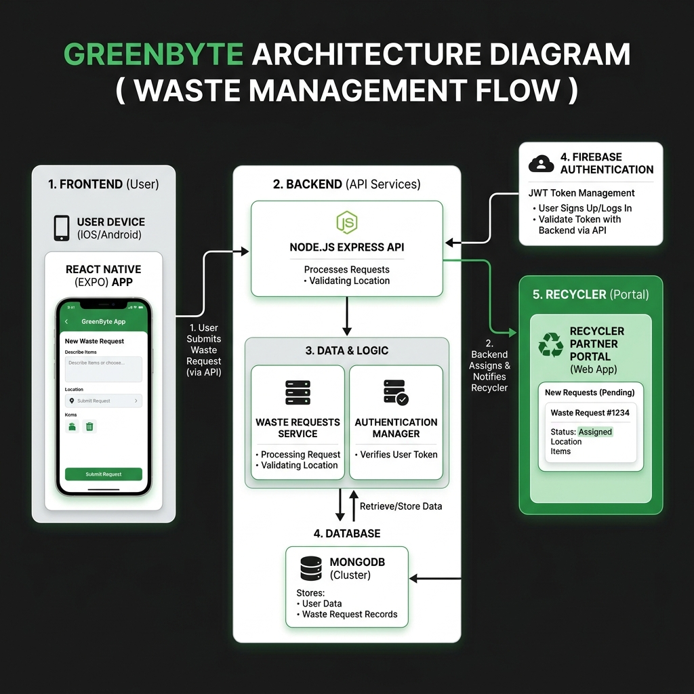
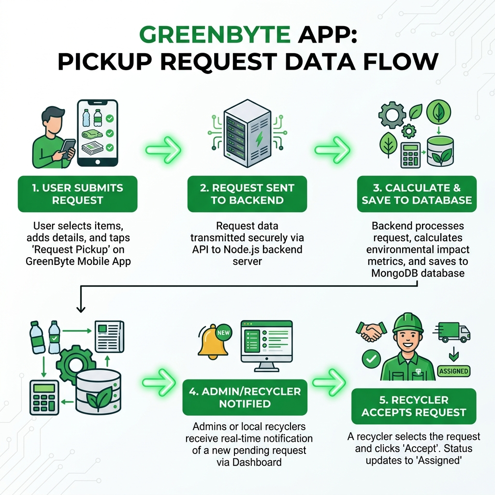
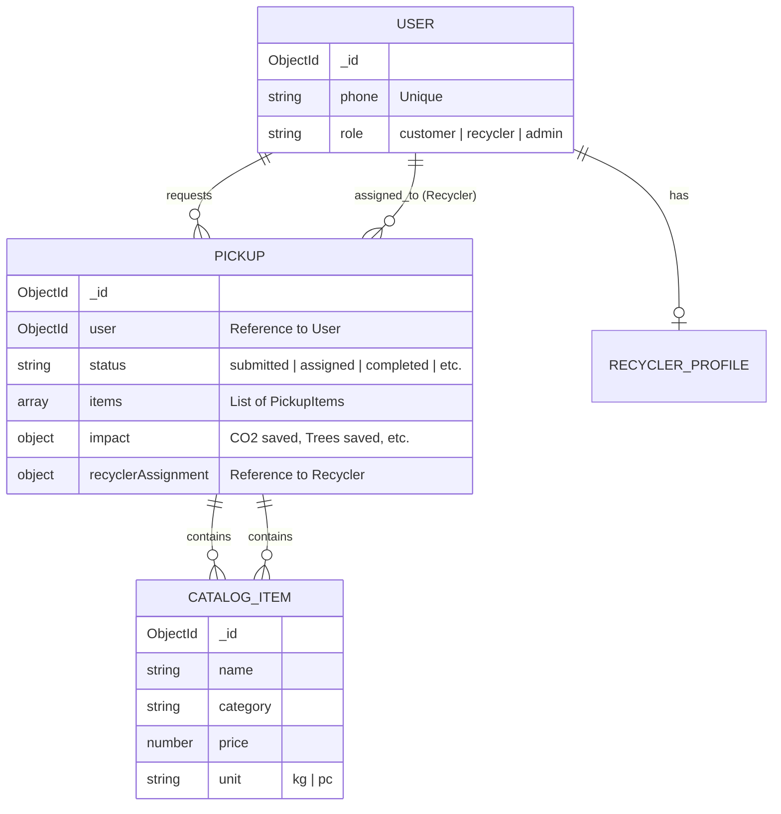

# GreenByte Backend & Database Analysis

This document provides a detailed overview of the backend architecture, database design, and core logic of the GreenByte application.

## 🏗️ Architecture Overview

GreenByte follows a modern, decoupled architecture with a focus on scalability and real-time interactions.

### Key Components
- **Frontend**: React Native (Expo) for mobile and React for web.
- **Backend API**: Node.js with Express, providing a RESTful interface.
- **Database**: MongoDB (NoSQL) for flexible data storage.
- **Authentication**: Firebase Auth for secure, cross-platform user management.
- **Infrastructure**: Containerized with Docker, making deployment consistent across environments.

---

## 🔄 Use Case: Pickup Request Data Flow

To better understand how the system works, here is the end-to-end data flow for a typical **Pickup Request**.

### Step-by-Step Data Journey

1.  **Request Initiation (Mobile)**:
    - The user selects recyclable items from the catalog in the Expo app.
    - The app sends a `POST` request to `/api/v1/pickups` with the items, user ID, and location data.
2.  **Processing & Calculation (Backend)**:
    - The Node.js server receives the request.
    - It validates the user's session via Firebase/JWT middleware.
    - It calculates environmental impact metrics (CO2 saved, trees saved) and the total estimate using the item rates from the database.
3.  **Persistence (MongoDB)**:
    - A new `Pickup` document is created with a `submitted` status.
    - The data is stored in the MongoDB `pickups` collection.
4.  **Notification & Visibility (Recycler/Admin)**:
    - The request becomes visible on the Recycler and Admin dashboards.
    - Real-time updates (via polling or future web sockets) inform the recycler of the new opportunity.
5.  **Assignment (Recycler Action)**:
    - A Recycler selects the request and clicks 'Accept'.
    - A `PUT` request is sent to `/api/v1/pickups/:id/assign`.
    - The pickup status in the database is updated to `assigned`, and the recycler's info is linked to the request.

---

## 🗄️ Database Design (MongoDB)

GreenByte uses MongoDB as its primary data store. Below is an Entity Relationship Diagram (ERD) visualizing the key collections and their relationships.

### Core Collections

#### 1. `Users`
Stores user profiles, roles (Customer, Recycler, Admin).
- **Key Fields**: `phone` (unique), `role`, `isVerified`.

#### 2. `Pickups`
The heart of the application, tracking the lifecycle of a waste collection request.
- **Key Fields**: `items` (embedded array), `status`, `pricing`, `impact` (calculated sustainability metrics), `recyclerAssignment`.

#### 3. `CatalogItems`
Defines the types of waste that can be recycled and their associated prices/units.
- **Categories**: Plastic, Paper, Metal, E-waste, etc.

---

## 🚀 API & Backend Logic

The backend is organized into standard MVC-like layers: **Routes**, **Controllers**, **Services**, and **Models**.

### Key API Endpoints (`/api/v1`)

| Endpoint | Method | Description |
| :--- | :--- | :--- |
| `/auth` | POST | OTP-based authentication flow. |
| `/pickups` | GET/POST | Create and manage pickup requests. |
| `/recyclers` | GET/PUT | Manage recycler assignments and schedules. |
| `/catalog` | GET | Retrieve the list of recyclable items and prices. |
| `/admin` | GET/PUT | Administrative dashboard and user management. |

### Core Workflows

#### ♻️ Pickup Request Lifecycle
1. **Submission**: User selects items from the `Catalog`. Backend calculates `impact` (CO2 saved, etc.) and `totalEstimate`.
2. **Estimation**: If complex, Admin/System provides a negotiated amount.
3. **Assignment**: A `Recycler` is assigned (manually or automatically) to the request.
4. **Collection**: Recycler marks as `collected` after physical pickup.
5. **Completion**: Upon successful processing, the request is marked as completed and archived.

#### 🔒 Security & Middleware
- **JWT / Auth Middleware**: Protects sensitive routes based on Firebase identity.
- **Error Handler**: Centralized error management for consistent API responses.
- **Data Validation**: Uses custom validators to ensure data integrity before database insertion.

---

## 🛠️ Technology Stack

- **Node.js**: Runtime environment.
- **Express**: Web framework for building APIs.
- **Mongoose**: ODM (Object Data Modeling) for MongoDB.
- **Firebase**: Authentication provider.
- **Morgan**: Request logging for development.
- **Docker**: Containerization for "write once, run anywhere".
